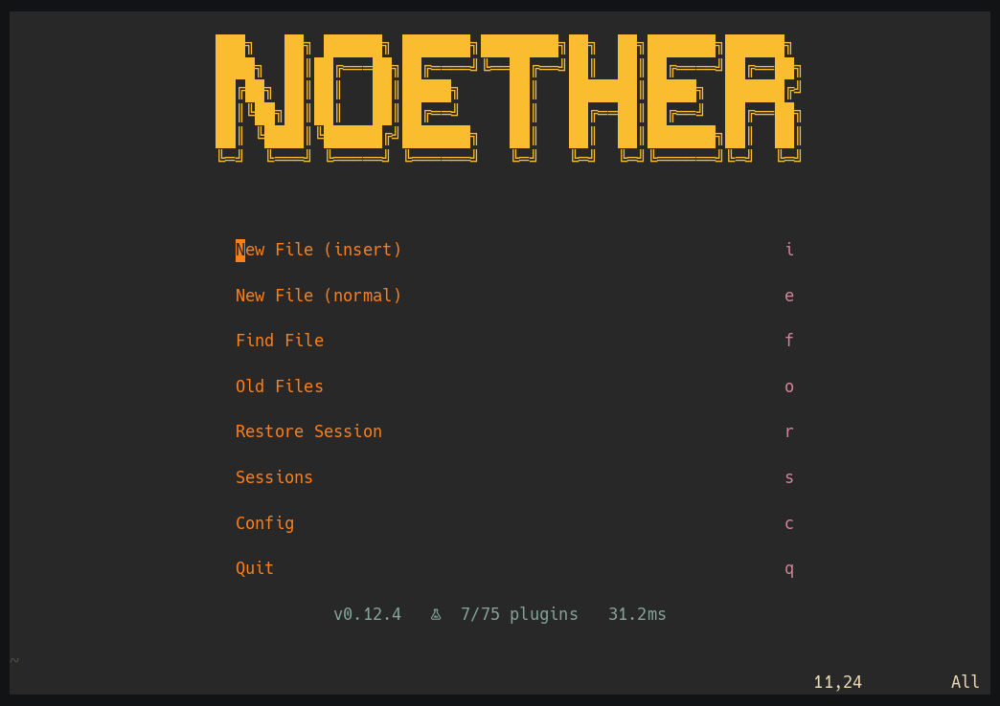
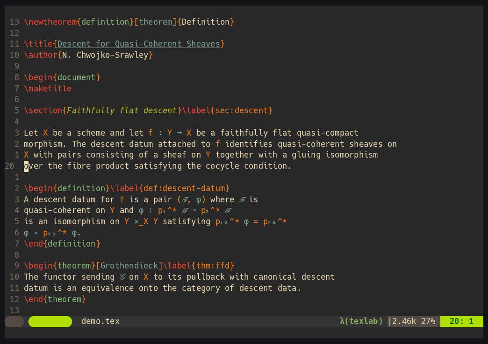

# NoetherVim

A Neovim distribution with a minimal abstraction layer, where LaTeX gets the same first-class treatment as LSP and treesitter.



Everything you'd expect is configured out of the box: completion (blink.cmp), diagnostics, formatters, treesitter, and aggressive lazy-loading for a fast startup. Debugging, testing, git UIs and language-specific tooling are opt-in bundles.

The distro is opinionated, but anything and everything can be overridden through `lua/user/`; in fact the distro's architecture prioritizes easy overriding (see [Configuration](#configuration)).

It is named after [Emmy Noether](https://en.wikipedia.org/wiki/Emmy_Noether), whose name also happens to contain *nvim* - *noether**Vim***.


> [!NOTE]
> NoetherVim is in **alpha**. The core is stable for daily use, but what counts as a "default" vs. an "overridable" option is still being refined. These choices grew out of my Neovim use and represent my best idea of good, agnostic defaults. If you think there are better choices, [open an issue](https://github.com/Chiarandini/NoetherVim/issues) and we can address it there.
>
> **Breaking changes during alpha do not ship with deprecation shims.** Renames, command consolidations, and option-key changes land directly, and the commit message says so. Deprecation notices (`vim.deprecate`), a changelog, and a SemVer compatibility window all begin at the first non-alpha release.


## Why another distribution?

There are many stable and mature Neovim distributions available:
[LazyVim](https://www.lazyvim.org/), [AstroNvim](https://docs.astronvim.com/),
[NvChad](https://nvchad.com/) and [LunarVim](https://www.lunarvim.org/) are all
actively maintained, and
[kickstart.nvim](https://github.com/nvim-lua/kickstart.nvim) is the standard
launch-pad. **If you want a distribution without strong preferences about
keymaps or workflows, LazyVim is probably the right pick.** It shares the same
"use Neovim primitives, no DSL" principle and has the biggest community.

NoetherVim exists for the cases where I wanted a different set of opinions:

- **Keybindings follow Vim's native prefix conventions, plus one addition.**
`<C-w>` for window manipulation, `[`/`]` for directional navigation, `[o`/`]o`
for option toggles, `g` for goto and LSP actions. `<Leader>` and
`<LocalLeader>` stay separated (global vs. filetype-specific, per `:help
maplocalleader`), so Vim-flavoured muscle memory transfers intact. The one
addition is a search leader, defaulting to `<Space>`, which owns every fuzzy
picker. See [Keybinding Philosophy](#keybinding-philosophy).

- **Inspection is built in.** `:NoetherVim diff keymaps` shows every distro
keymap your config has overridden, and `:NoetherVim diff options` does the same
for options. "What does this distro actually change?" should be a one-command
question, even after you layer your own config on top.

- **LaTeX, BibTeX and VimTeX are first-class.** The distro ships custom
Snacks-based label and heading pickers, preamble snippets, BibTeX and Zotero
citation tooling, and adds 1000+ mathematical terms and names to the spell
dictionary. See the [onboarding guide for
mathematicians](docs/onboarding/mathematicians.md).

- **Bundles cover non-coding work.** `writing/` (obsidian, neorg, markdown),
`practice/` (training, hardtime, presentation) and `terminal/` (tmux,
remote-dev) are first-class categories alongside `languages/` and `tools/`.

Neovim 0.12 ships a built-in package manager (`vim.pack`), but NoetherVim
stays on lazy.nvim because the override model (deep-merged `opts`,
auto-imported bundle directories, lazy-loading via `event`/`keys`/`cmd`/`ft`)
depends on its spec system; `vim.pack` is a plain installer and doesn't
provide that layer yet.

There is a personal reason too. After ten years of Vim and Neovim my dotfiles
had grown to roughly 10k lines, so this is partly a project to turn that
personal setup into something other people can use.

## Requirements

- Neovim >= 0.12
- A [Nerd Font](https://www.nerdfonts.com/) for icons along with a compatible terminal.
- `git`, `fd`, `ripgrep`, a C compiler (for treesitter parsers)

<details>
<summary>Neovim: Platform install commands</summary>

**macOS**
```bash
brew install neovim ripgrep fd
```

**Ubuntu / Debian**
> `apt install neovim` ships an outdated version on most releases.
> Use the [Neovim PPA](https://github.com/neovim/neovim/blob/master/INSTALL.md#ubuntu),
> an [AppImage](https://github.com/neovim/neovim/releases), or
> [bob](https://github.com/MordechaiHadad/bob) to get Neovim >= 0.12.
```bash
sudo apt install ripgrep fd-find
```

**Arch**
```bash
sudo pacman -S neovim ripgrep fd
```

**Fedora**
```bash
sudo dnf install neovim ripgrep fd-find
```

</details>

Some bundles need tools you install yourself. Optional extras are left out
here; `:checkhealth noethervim` reports the full picture for the bundles you
actually enabled, and every bundle file lists its own requirements in its
header.

<details>
<summary>Bundles: extra tooling</summary>

<!-- BEGIN GENERATED: bundle-requirements -->
- `go` needs Go toolchain
- `java` needs a JDK
- `latex` needs latexmk
- `latex-zotero` needs Zotero, sqlite3
- `python` needs Python 3
- `rust` needs rust-analyzer, Cargo
- `web-dev` needs Node.js
- `remote-dev` needs distant, distant on the remote host
- `tmux` needs tmux
- `ai` needs curl
- `git` needs libgit2
- `http` needs curl
- `octo` needs GitHub CLI
- `repl` needs a REPL for your language
- `task-runner` needs your project build tool
- `obsidian` needs a vault path
<!-- END GENERATED: bundle-requirements -->
</details>

## Installation

Copy the starter config and open Neovim:

```bash
mkdir -p ~/.config/nvim
curl -fLo ~/.config/nvim/init.lua https://raw.githubusercontent.com/Chiarandini/NoetherVim/main/init.lua.example
nvim
```
This copies NoetherVim's `init.lua` template, which auto-installs lazy.nvim + NoetherVim and the core
plugins, and has all bundles commented out. On first launch, lazy.nvim bootstraps itself, pulls all
plugins, and runs `noethervim.setup()`. If you know what you're doing you can write the `init.lua`
file yourself - this documentation will assume you used the init.lua template provided by
NoetherVim.


> [!IMPORTANT]
> If you have an existing Neovim config, back it up first before running the above command:
> ```bash
> mv ~/.config/nvim ~/.config/nvim.bak
> mv ~/.local/share/nvim ~/.local/share/nvim.bak
> mv ~/.local/state/nvim ~/.local/state/nvim.bak
> mv ~/.cache/nvim ~/.cache/nvim.bak
> ```
> see [migrating from an existing config](#migrating-from-an-existing-config) for granular
> migration options.

> [!TIP]
> **Want to try NoetherVim without replacing your config?** Neovim's `NVIM_APPNAME` feature lets you run multiple configs side by side:
> ```bash
> mkdir -p ~/.config/noethervim
> curl -fLo ~/.config/noethervim/init.lua \
>   https://raw.githubusercontent.com/Chiarandini/NoetherVim/main/init.lua.example
> NVIM_APPNAME=noethervim nvim
> ```
> Your existing `~/.config/nvim/` stays untouched. Add `alias nv='NVIM_APPNAME=noethervim nvim'` (where `nv` can be replaced by any name you want) to your shell profile for convenience.

### Updating

Run `:Lazy update` inside Neovim. This updates the distro and all plugins.

### Migrating from an existing config

Once you're running, you can bring over your personal settings:
- **Plugins**: add lazy.nvim specs to `lua/user/plugins/` (see [Configuration](#configuration))
- **Options/keymaps/autocmds**: check what the distro defaults to before re-adding (type
  `:NoetherVim diff {keymaps/options}` to check out the distro's keymaps)
- **LSP configs**: NoetherVim configures servers through `lua/noethervim/lsp/`; if you had custom server settings, look there first

### Uninstalling

Quick crash course: the following are important files/locations for any Neovim setup

| Path | Contents |
|---|---|
| `~/.config/nvim/init.lua` | Neovim's entry point that bootstraps your personal config |
| `~/.config/nvim/lua/user/` | Your plugin specs, option/keymap/autocmd overrides |
| `~/.config/nvim/lazy-lock.json` | Your pinned plugin versions |
| `~/.local/state/nvim/` | Shada (command/search history, marks, registers), undo history, sessions, views |
| `~/.local/share/nvim/site/spell/` | Custom spell additions |

Everything else under `~/.local/share/nvim/` and `~/.cache/nvim/` is installed or generated by the distro and can be regenerated by relaunching Neovim.

**To reset the distribution and keep personal data, run**
```bash
rm -rf ~/.local/share/nvim ~/.cache/nvim
```
This wipes installed plugins (lazy.nvim, NoetherVim, everything else), Mason-managed LSP servers and formatters, and all caches. Your `init.lua`, `lua/user/`, and editing state (history, undo, sessions) stay intact. Next launch re-bootstraps and reinstalls everything from scratch.


**To reset the distribution and editing state**
```bash
rm -rf ~/.local/share/nvim ~/.local/state/nvim ~/.cache/nvim
```
Same as above but also drops shada, undo history, sessions, and views. Config is still preserved.


**To fully uninstall**
```bash
rm -rf ~/.config/nvim ~/.local/share/nvim ~/.local/state/nvim ~/.cache/nvim
```
Removes the config, data, state, and cache directories. Restore your backup if you made one.


> [!TIP]
> If you installed with `NVIM_APPNAME=noethervim`, substitute `noethervim` for `nvim` in every path above.


## Usage

Open `nvim` and you get a dashboard. Press `f` to find a file, and you are in
a normal buffer with LSP, completion, treesitter, formatting and diagnostics
already attached.

Three commands orient you, and between them answer most first-day questions:

| Key | Command | Answers |
|---|---|---|
| `<Space>?` | `:NoetherVim keymap-guide` | What is bound, grouped by namespace. `<CR>` jumps to where a keymap was defined |
| `<Space>cb` | `:NoetherVim bundles` | What else can I turn on, and what does each bundle need installed |
| | `:checkhealth noethervim` | Is anything about my setup wrong |

Press any prefix key and wait, and which-key lists what follows it. That habit
is worth more than memorising the tables below.

**[Your first session](docs/onboarding/first-session.md)** is a twenty-minute
walkthrough that ends with a configuration file of your own, one bundle
enabled, and a clean health check. **Coming in primarily for LaTeX?** Continue
with the [onboarding guide for
mathematicians](docs/onboarding/mathematicians.md): the math bundles,
snippets, citations, and how to extend the setup.

## Configuration

### Enabling bundles

Open `~/.config/nvim/init.lua` and uncomment the bundles you want in the `spec` table. Each import path is `noethervim.bundles.<category>.<name>`:

```lua
-- inside require("lazy").setup({ spec = { ... } })
{ import = "noethervim.bundles.languages.latex" },
{ import = "noethervim.bundles.tools.debug" },
{ import = "noethervim.bundles.tools.git" },
```

All bundles are opt-in - the core is fully functional with none enabled. See [Bundles](#bundles) for the full list.

> [!TIP]
> Don't want to edit `init.lua` by hand? Open `:NoetherVim bundles` (or SearchLeader+cb), highlight a bundle, and press `<C-y>` to enable or `<C-x>` to disable. A diff prompt shows the exact change before anything is written; `y` or `<CR>` accepts it. `<C-o>` seeds a file for overriding the bundle's own settings.

### Adding your own plugins

Drop plugin specs in `~/.config/nvim/lua/user/plugins/`. Any `.lua` file there is auto-imported by lazy.nvim. To override an existing plugin's settings, use the same repository string - lazy.nvim deep-merges `opts` automatically:

```lua
-- ~/.config/nvim/lua/user/plugins/snacks.lua
return {
    { "folke/snacks.nvim",
      opts = { picker = { layout = { preset = "vertical" } } },
    },
}
```

For array-valued opts (`ensure_installed`, `formatters_by_ft`, etc.), the function-form `opts`, and adding extra `keys`/`cmd`/`event` triggers, see `:help noethervim-user-plugins`.

Plugins deliberately left out of the distribution (AI completion, translation, AI code actions, lighter jump motions) have copy-paste specs and the reasoning behind each omission in [`docs/user-config-examples.md`](docs/user-config-examples.md). For scaffolding your own files, run `:NoetherVim templates` inside Neovim.

### Overriding options, keymaps, and more

NoetherVim loads user override files after each core module. Create any of these in `~/.config/nvim/lua/user/`:

| File | What it overrides |
|---|---|
| `options.lua` | `vim.o` / `vim.g` settings |
| `keymaps.lua` | Keymaps (add, change, or remove) |
| `autocmds.lua` | Autocommands |
| `highlights.lua` | Highlight groups (runs after colorscheme) |
| `lsp/<server>.lua` | Per-server LSP settings |
| `config.lua` | Config data table: vault paths, feature flags, filetype lists (`:help noethervim-user-config-data`) |

Template files are provided in `templates/user/` in the installed distro - copy the ones you want and uncomment the relevant lines. The fastest way to grab one is `:NoetherVim templates` (or SearchLeader+ct): pick a template and press `<C-y>` to stamp it into `lua/user/`. A diff prompt shows the change first, `y` or `<CR>` accepts, and the new file opens for editing.

Your config ends up laid out like this:

```
~/.config/nvim/
├── init.lua                ← lazy.setup() entry - enable bundles here
└── lua/
    └── user/
        ├── plugins/        ← your plugins and opts overrides on distro plugins
        ├── options.lua     ← vim.o / vim.g overrides
        ├── keymaps.lua     ← keymap overrides and additions
        ├── autocmds.lua    ← autocommand additions
        ├── highlights.lua  ← highlight overrides (runs after colorscheme)
        ├── lsp/            ← per-server LSP overrides
        └── config.lua      ← data table (vault paths, filetype lists, flags)
```

For the full override system reference, see `:help noethervim-user-config`.

---

## Bundles

Bundles are optional feature groups, enabled in `init.lua` (see [Enabling bundles](#enabling-bundles)). The core is fully functional with none enabled. Full descriptions and per-bundle requirements live in [the bundle reference](https://nathanaelsrawley.com/noethervim/guides/bundles/).

<!-- BEGIN GENERATED: bundle-table -->
| Category | Bundles |
|---|---|
| Programming languages | [`go`](https://nathanaelsrawley.com/noethervim/guides/bundles/#go), [`java`](https://nathanaelsrawley.com/noethervim/guides/bundles/#java), [`latex`](https://nathanaelsrawley.com/noethervim/guides/bundles/#latex), [`latex-zotero`](https://nathanaelsrawley.com/noethervim/guides/bundles/#latex-zotero), [`python`](https://nathanaelsrawley.com/noethervim/guides/bundles/#python), [`rust`](https://nathanaelsrawley.com/noethervim/guides/bundles/#rust), [`web-dev`](https://nathanaelsrawley.com/noethervim/guides/bundles/#web-dev) |
| Tools | [`ai`](https://nathanaelsrawley.com/noethervim/guides/bundles/#ai), [`database`](https://nathanaelsrawley.com/noethervim/guides/bundles/#database), [`debug`](https://nathanaelsrawley.com/noethervim/guides/bundles/#debug), [`git`](https://nathanaelsrawley.com/noethervim/guides/bundles/#git), [`http`](https://nathanaelsrawley.com/noethervim/guides/bundles/#http), [`nvim-dev`](https://nathanaelsrawley.com/noethervim/guides/bundles/#nvim-dev), [`octo`](https://nathanaelsrawley.com/noethervim/guides/bundles/#octo), [`refactoring`](https://nathanaelsrawley.com/noethervim/guides/bundles/#refactoring), [`repl`](https://nathanaelsrawley.com/noethervim/guides/bundles/#repl), [`task-runner`](https://nathanaelsrawley.com/noethervim/guides/bundles/#task-runner), [`test`](https://nathanaelsrawley.com/noethervim/guides/bundles/#test) |
| Navigation & editing | [`editing-extras`](https://nathanaelsrawley.com/noethervim/guides/bundles/#editing-extras), [`flash`](https://nathanaelsrawley.com/noethervim/guides/bundles/#flash), [`harpoon`](https://nathanaelsrawley.com/noethervim/guides/bundles/#harpoon), [`projects`](https://nathanaelsrawley.com/noethervim/guides/bundles/#projects), [`yanky`](https://nathanaelsrawley.com/noethervim/guides/bundles/#yanky) |
| Writing & notes | [`markdown`](https://nathanaelsrawley.com/noethervim/guides/bundles/#markdown), [`neorg`](https://nathanaelsrawley.com/noethervim/guides/bundles/#neorg), [`obsidian`](https://nathanaelsrawley.com/noethervim/guides/bundles/#obsidian), [`wrapsearch`](https://nathanaelsrawley.com/noethervim/guides/bundles/#wrapsearch) |
| Terminal & environment | [`better-term`](https://nathanaelsrawley.com/noethervim/guides/bundles/#better-term), [`remote-dev`](https://nathanaelsrawley.com/noethervim/guides/bundles/#remote-dev), [`tmux`](https://nathanaelsrawley.com/noethervim/guides/bundles/#tmux) |
| UI & appearance | [`colorscheme`](https://nathanaelsrawley.com/noethervim/guides/bundles/#colorscheme), [`eye-candy`](https://nathanaelsrawley.com/noethervim/guides/bundles/#eye-candy), [`helpview`](https://nathanaelsrawley.com/noethervim/guides/bundles/#helpview), [`minimap`](https://nathanaelsrawley.com/noethervim/guides/bundles/#minimap), [`tableaux`](https://nathanaelsrawley.com/noethervim/guides/bundles/#tableaux) |
| Practice & utilities | [`hardtime`](https://nathanaelsrawley.com/noethervim/guides/bundles/#hardtime), [`presentation`](https://nathanaelsrawley.com/noethervim/guides/bundles/#presentation), [`training`](https://nathanaelsrawley.com/noethervim/guides/bundles/#training) |
<!-- END GENERATED: bundle-table -->

---

## Keybinding Philosophy

| Prefix | Purpose |
|---|---|
| `<Space>` (configurable) | Fuzzy navigation and search; set `vim.g.mapsearchleader` to change |
| `<Leader>` (`\`) | Global actions (format, open tools) |
| `<LocalLeader>` (`,`) | Filetype-specific actions (compile LaTeX, run script) |
| `<C-w>` | All window navigation and manipulation |
| `[` / `]` | Previous / next (diagnostics, hunks, buffers, …) |
| `[o` / `]o` | Toggle options on / off (wrap, spell, …) |

`q` closes non-editing windows (help, quickfix, notify, man, …)

**Discovering distro keymaps:** press any prefix key and wait for which-key to show what follows it. SearchLeader+ck (default `<Space>ck`), or `:NoetherVim diff keymaps`, searches every keymap in the distribution and your own files by description, and marks the ones you have overridden. Keymaps contributed by a bundle are labelled with the bundle's name, so typing `latex` narrows the list to the latex bundle. To search every active mapping, including Neovim's own and those added by plugins, use SearchLeader+fk (default `<Space>fk`).




---

## Reference

Everything here is authoritative and lives inside Neovim, where it stays in
step with the version you actually have installed. The same manual is
published at
[nathanaelsrawley.com/noethervim/reference](https://nathanaelsrawley.com/noethervim/reference/),
generated from the same file, for reading before you install or for linking
to a specific section.

| Command | What it answers |
|---|---|
| `:help noethervim` | The full reference: configuration system, keymap namespaces, commands, bundle details, FAQ |
| `:checkhealth noethervim` | Is my setup correct? Required and optional dependencies, per enabled bundle |
| `:NoetherVim` | Every subcommand, with a one-line description each |
| `:NoetherVim files` / `bundles` / `plugins` | Browse the distribution's source, the bundle catalogue, installed plugins |
| `:NoetherVim override` (`<Leader>e`) | From any source file, open the matching user override, creating it if needed |
| `:NoetherVim diff keymaps` / `options` / `autocmds` | What have I changed relative to the defaults? |

The distribution installs to `~/.local/share/nvim/lazy/NoetherVim/`; your own
configuration stays in `~/.config/nvim/`. The two trees never overlap, which
is what makes `git pull` safe. See
[Overriding options, keymaps, and more](#overriding-options-keymaps-and-more).

> [!NOTE]
> If muscle memory makes you type `:NeotherVim`, that works too.

## Maintainers

[@Chiarandini](https://github.com/Chiarandini)

## Contributing

Issues and pull requests are welcome:
[open an issue](https://github.com/Chiarandini/NoetherVim/issues).

Because the distribution is in alpha, the most useful contribution right now
is a report of a default that got in your way, along with what you expected
instead. `:NoetherVim diff keymaps` and `diff options` show exactly what you
had to change, which makes for a precise report.

## License

[MIT](LICENSE) © 2024-2026 Chiarandini
